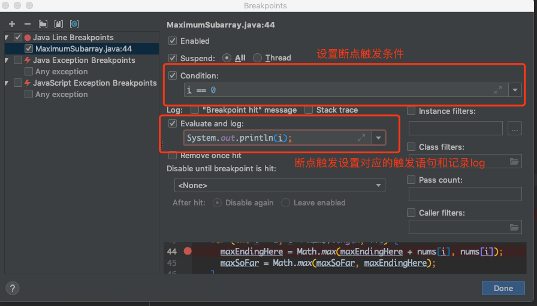
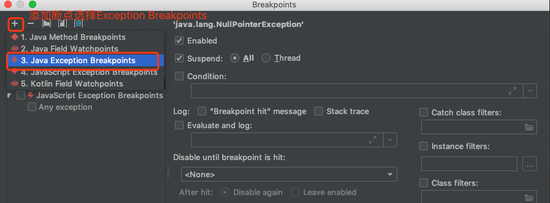
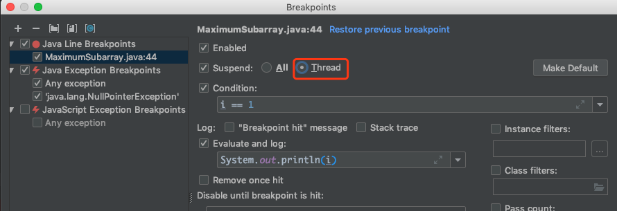
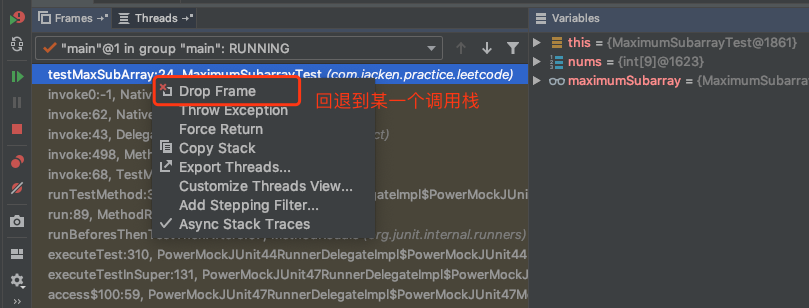

# Algorithm(LeetCode 136：Single Number)

Given a non-empty array of integers, every element appears twice except for one. Find that single one.

解析：找出一个数组只出现过一次的数字，这个可以遍历数组中的数据，然后使用Set来存储数组中的数据，当数据在Set中存在时就把数据从Set中移除，否则就存储到Set中，最后Set中只会保存一个元素，就是数组中只出现一次的元素。这是其中一种常规
的实现思路，空间复杂度为O(n)，然而却有一种实现思路是可以使得时间复杂度和空间复杂度都为O(n)，那就是使用异或运算，异或运算可以使得两个相等的数运算后结果为0，这样子当所有的结果遍历一遍运算后，得到最终的结果就是出现过一次的数字。

  ```java
  
  import java.util.HashSet;
  import java.util.Set;
  
  /**
   * @author jacken
   * @date 2019/08/27
   */
  public class SingleNumber {
  
    public int singleNumber2(int[] nums) {
      Set<Integer> set = new HashSet<>();
      for (int num : nums) {
        if (set.contains(num)) {
          set.remove(num);
          continue;
        }
  
        set.add(num);
      }
  
      return set.toArray(new Integer[0])[0];
    }
  
    public int singleNumber(int[] nums) {
      int result = 0;
      for (int i = 0; i < nums.length; i++) {
        result ^= nums[i];
      }
  
      return result;
    }
  
  }


  ```

# Review  

  Effective Java Item 10
  
  覆盖equals方法时需要遵守以下的规则：
  1. 自反性：a.equals(a)返回true
  2. 对称性：x.equals(y)=y.equals(x)
  3. 传递性：x.equals(y), y.equals(z) => x.equals(z)
  4. 一致性：x.equals(y)在变量不变的情况下永远返回一样的结果
  5. x.equals(null)必须返回false
  
  下面是一个比较标准的覆盖equals的写法：
  ```java
  
  public class SingleNumber {
  
    private int number;
  
     @Override
    public boolean equals(Object obj) {
      if (obj == this) {
        return true;
      }
  
      if (!(obj instanceof SingleNumber)) {
        return false;
      }
  
      SingleNumber singleNumber = (SingleNumber)obj;
      return singleNumber.number == this.number;
    }
  }
  
  ```
  
  Effective Java Item 11
  
  覆盖equals时总是覆盖hashcode方法
  
  Effective Java Item 12
  
  总是覆盖toString方法
  
  因为toString方法要求是简洁可读的，总是在打印对象的信息时会调用，希望从中可以获取到对象的运行信息，所以覆盖toString可以帮助我们在debug时，获取详细的游泳的对象信息。
 

# Tips
  
  idea Debug技巧：
  1. 断点调试时可以通过设置断点Evaluate and log来执行到达断点行需要执行的命令和记录日志。
  2. 可以设置condition来指定当到达某个条件后断点才触发。
  
  3. 可以添加由某个异常而触发的断点，断点会在异常触发代码行停止。
  
  4. 一行代码有好几个方法，可以通过Shift + F7键智能步入，选择需要debug进入的方法。
  5. 多线程调试时，设置断点为ALL会导致阻塞其他线程的运行，可以选择Thread阻塞级别。
  
  6. 当需要回退到某一个断点执行时，可以在debug的调用栈里面右键选择需要回退的调用栈选择Drop Frame便可以回退到该断点，该断点回退只能重新走一下流程，无法回退已经修改的变量和状态。
  
  
# Share
  
  
  
  
