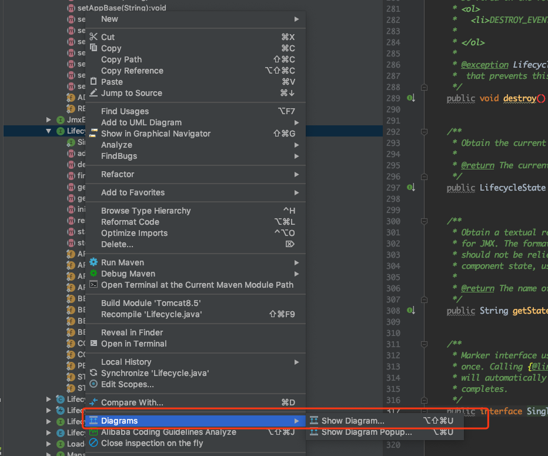
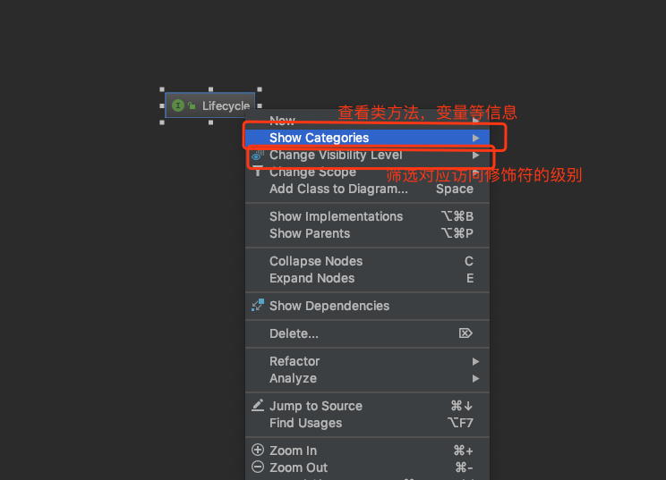
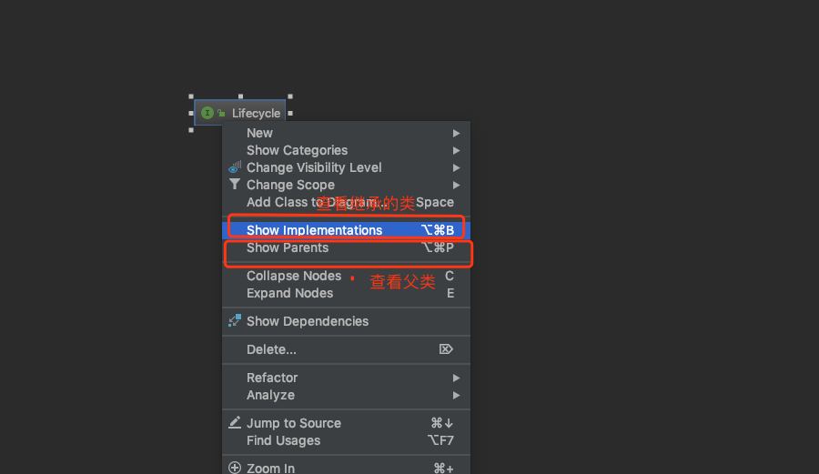

# Algorithm(LeetCode 101：Symmetric Tree)

Given a binary tree, check whether it is a mirror of itself (ie, symmetric around its center).


解析：判断一棵树是否是对称树，根节点不需要进行对比，对于每一个左节点和一个右节点来说，首先我们需要判断左右节点是否相等，然后我们我们需要比对左节点的子左节点和右节点的子右节点，左节点的子右节点和右节点的子左节点是否相等，形成递归条件。

  ```java
  
  /**
   * 对称树
   * 
   * @author jacken
   * @date 2019/09/18
   */
  public class SymmetricTree {
  
  
    public boolean isSymmetric(TreeNode root) {
      if (root == null) {
        return false;
      }
  
      return compareTree(root.left, root.right);
  
    }
  
    private boolean compareTree(TreeNode left, TreeNode right) {
      if (left == null || right == null) {
        return left == right;
      }
  
      if (left.val != right.val) {
        return false;
      }
  
      return compareTree(left.left, right.right) && compareTree(left.right, right.left);
    }
  }


  ```

# Review  
  
  ### Effective Java Item 13
  慎重覆盖clone方法
  因为clone会涉及到final对象和深度变量对象的copy问题，考虑使用复制工厂或者是复制构造函数代替实现cloneable方法
  ```java
  
  public Yum(Yum yum){}
  
  public static Yum newIntance(Yum yum){}
  
  ```
  
  ### Effective Java Item 14
  
  考虑实现Comparable
  在你的对象需要按照一定的顺序排序时，考虑实现Comparable接口，可以很方便的调用java标准类库里面的方法去实现你的功能，需要满足以下属性,使用Comparator接口时，使用对象的比较方法而避免使用>和<操作符,因为有对应的数字装箱类型可以使用，避免出错。
  1. 自反性
  2. 对称性
  3. 传递性
 

# Tips
  
  在idea中查看某个类的继承结构技巧：
  1. 在需要查看的某个类右键点击找到以下选项
  
  2. 然后可以在图标中右键点击查看对应的类的继承关系和内部方法和变量
  
  
  
# Share

  [技术总结](https://mp.weixin.qq.com/s/GntRFHMgE2FalMul6xq4Bw)
  
  
  
  
  
  
